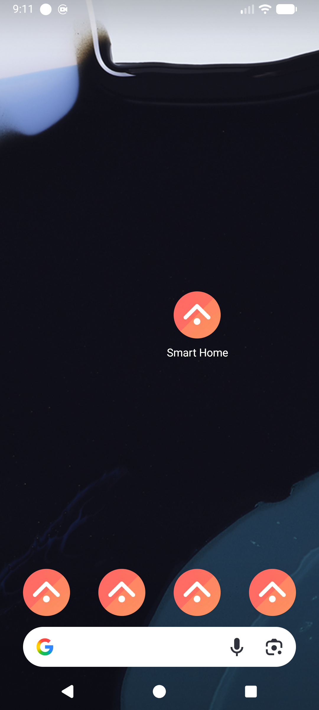
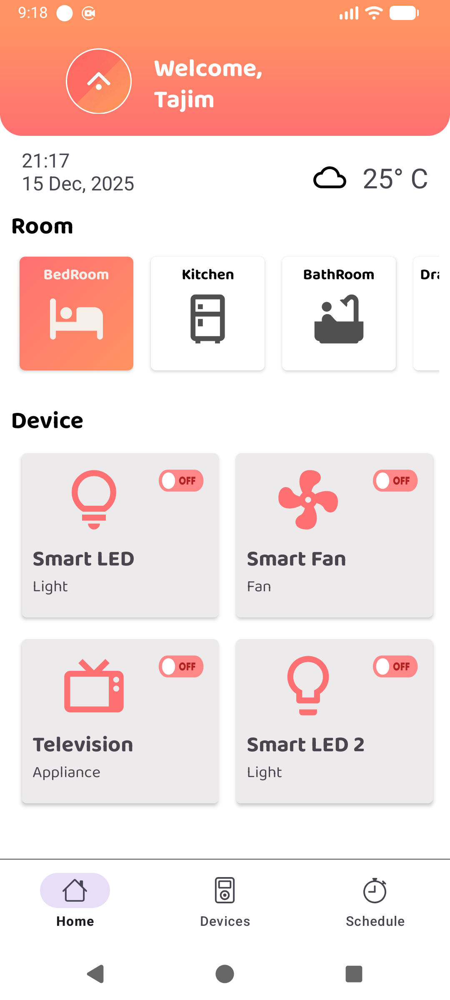
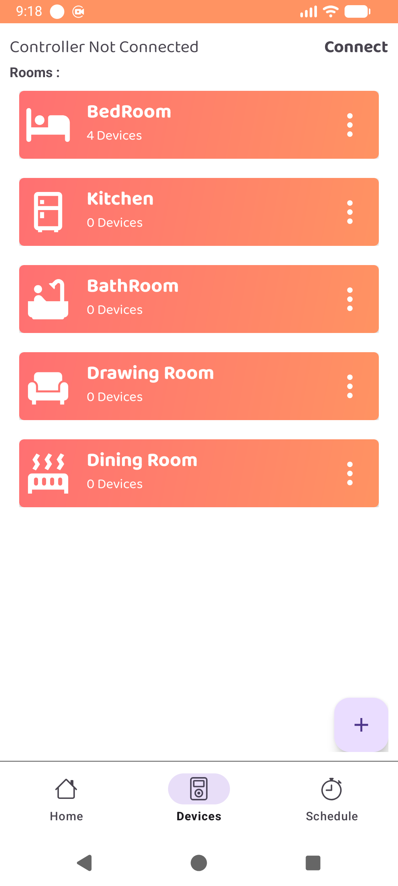
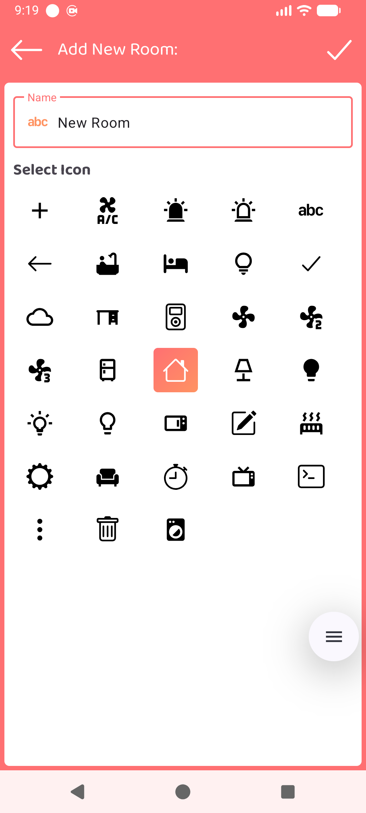
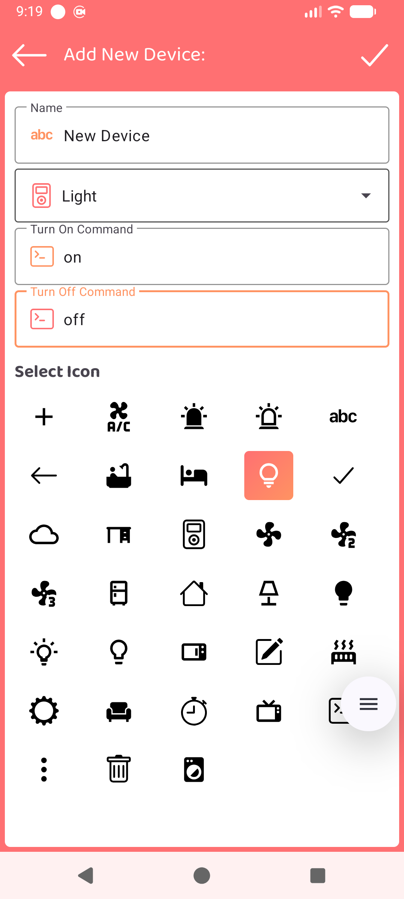
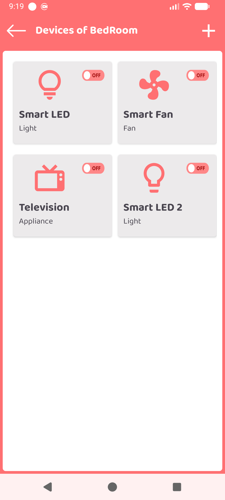
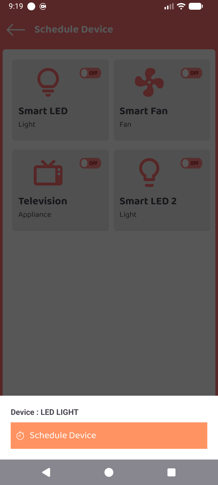
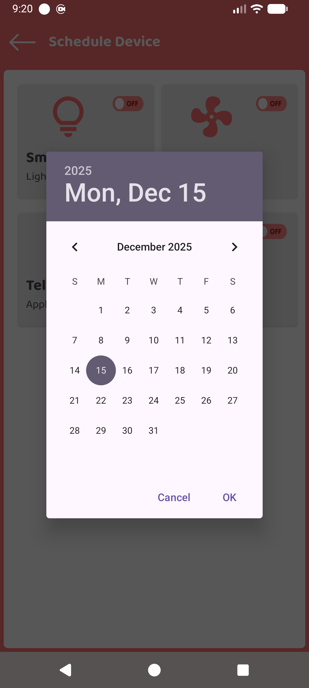
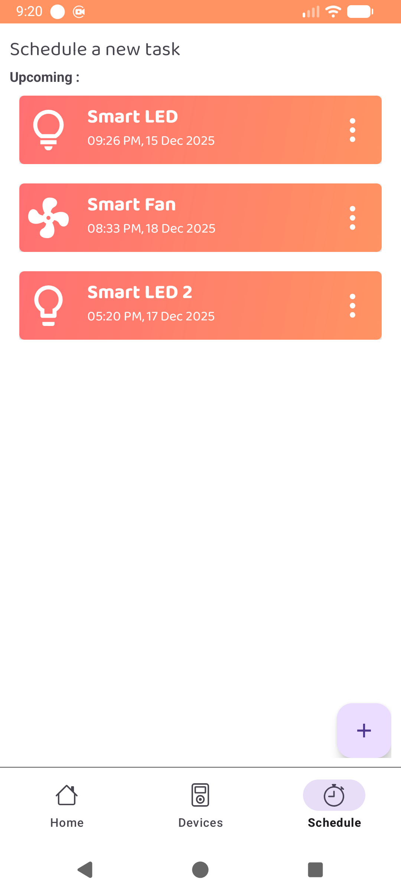
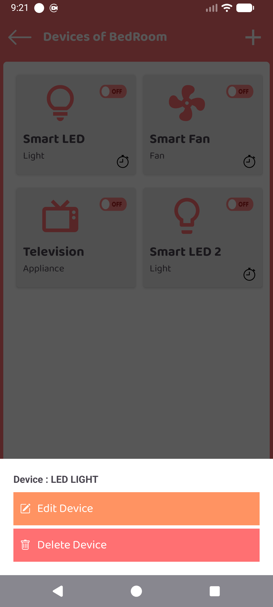

# 🏠 Smart Home

**Smart Home** is an Android application that converts a traditional (analog) home setup into a **customizable digital smart home** using Bluetooth communication with microcontrollers.

The app works as a **Bluetooth terminal** that allows users to create rooms, add devices, assign **custom commands**, and **schedule actions** for their microcontroller-based devices (Arduino, etc.) using Bluetooth modules like **HC-05 / HC-06**.

---

## 🚀 Features

* 📱 Android Bluetooth terminal
* 🏠 Create unlimited custom rooms
* 🔌 Add multiple devices per room
* ⚙️ Assign custom commands for each device
* ⏰ **Schedule device actions by time & date**
* 🔁 Real-time Bluetooth communication
* 🧠 Works with Arduino and similar microcontrollers
* 🧩 Fully customizable — no fixed protocol required

---

## ⏰ Scheduling System

Users can **schedule commands** to be executed at a specific time and date.

Example:

* Turn lights **ON at 7:00 PM**
* Turn fan **OFF at 11:30 PM**

The app triggers the scheduled task and sends the assigned Bluetooth command automatically to the microcontroller.

---

## 🛠️ How It Works

1. Connect your Android device to a Bluetooth module (HC-05 / HC-06).
2. Create rooms and devices inside the app.
3. Assign custom Bluetooth commands to each device.
4. (Optional) Set a **schedule** for any device action.
5. At the scheduled time, the app sends the command to the microcontroller.
6. The microcontroller processes the command and controls the hardware.

---

## 🔌 Supported Hardware

* Arduino (UNO, Nano, Mega, etc.)
* Bluetooth modules:

  * HC-05
  * HC-06
* Any microcontroller supporting serial Bluetooth communication

---

## 🧩 Use Cases

* Home automation
* Scheduled lighting control
* DIY smart switch boards
* Student / academic projects
* IoT & automation prototypes

---

## 📦 Tech Stack

* **Android Studio**
* **Java**
* **XML (ConstraintLayout)**
* **Bluetooth Classic**
* **AlarmManager (Scheduling)**
* **ViewBinding**

---

## ⚠️ Requirements

* Android device with Bluetooth support
* Paired Bluetooth module
* Microcontroller programmed to handle incoming commands

---

## 🧪 Example Command Flow

```text
Scheduled Time → App Trigger → Bluetooth Send → Microcontroller → Device Action
```

Example:

```text
07:00 PM → "LIGHT_ON" → Relay HIGH
```

---

## 📸 Screenshots

<p float="left">
  
  
  
  
</p>

<p float="left">
  
  
  
  
</p>

<p float="left">
  
  
</p>


---

## 📌 Future Plans

* 🌐 Wi-Fi / ESP support
* 📊 Device status feedback
* 🧠 Automation rules & scenes
* ☁️ Cloud backup
* 🎨 UI themes

---

## 🤝 Contributing

Pull requests and feature suggestions are welcome.

---

## 📄 License

This code is open for reading and learning purposes only. 
You may not modify, redistribute, or use it commercially without explicit permission from the author.


